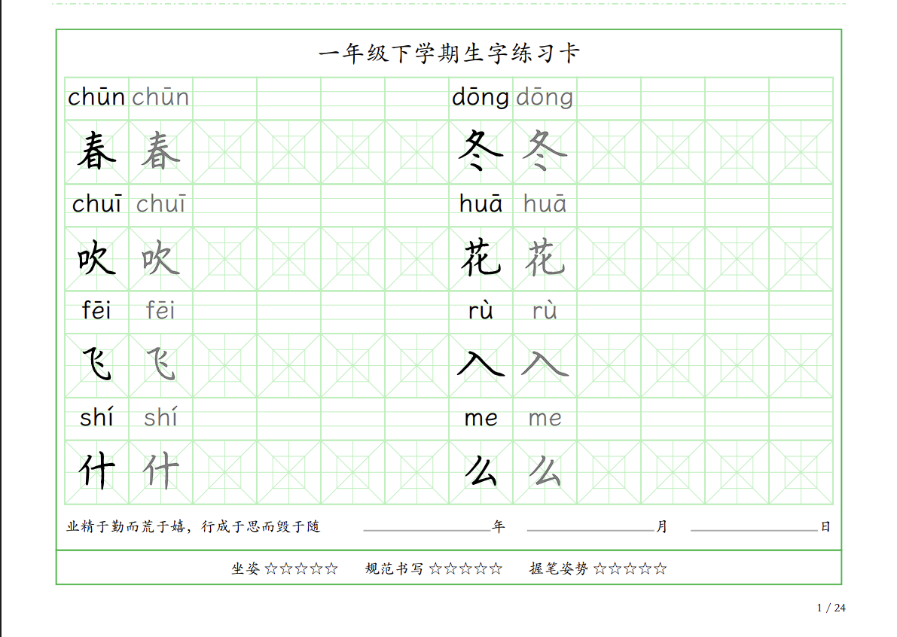
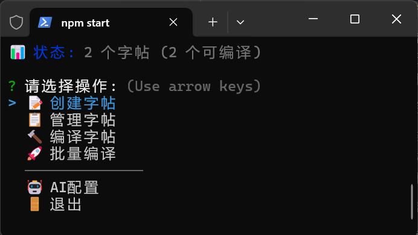

# 🎨 智能练字卡生成器

> 基于 Typst 的小学生字练习卡生成工具，支持 AI 智能拼音标注，自动生成带拼音的汉字练习卡片


*练字卡效果展示（截取）*

## ✨ 核心特性

### 🤖 AI 智能拼音生成
- **智能识别汉字**：自动提取文本中的汉字
- **精准拼音标注**：支持 OpenAI、Azure OpenAI 等多种 AI 服务
- **自定义提示词**：可配置专业的拼音生成规则
- **智能备用方案**：AI 不可用时自动降级处理

### 📚 专业字帖管理
- **标准化格式**：txt 文本 → json 数据 → PDF 输出的完整流程
- **多字体支持**：楷书、行书、隶书等传统书法字体
- **灵活配置**：每个字帖独立配置，支持个性化定制
- **批量处理**：一键生成多个字帖的不同字体版本

### 🎯 智能化操作
- **交互式界面**：清爽的命令行操作体验
- **智能刷新**：文本修改后自动重新生成拼音数据
- **预览确认**：操作前智能预览，避免误操作
- **实时反馈**：详细的处理进度和结果展示

## 🚀 快速开始

### 环境要求

- **Typst** >= 0.11.0 （PDF 生成引擎）
- **Node.js** >= 16.0.0 （运行环境）
- **AI API Key**（可选，用于智能拼音生成）

### 安装步骤

```bash
# 1. 克隆项目
git clone https://github.com/taliove/HandwritingPrint.git
cd 练字打印

# 2. 安装依赖
npm install

# 3. 启动系统
npm start
```


*主界面演示*

### 首次使用

1. **配置 AI 服务**（推荐）
2. **创建第一个字帖**


3. **生成练字卡**


## 🎯 主要功能

### 📝 字帖管理
- **创建字帖**：向导式创建，支持从文本文件导入
- **编辑内容**：直接编辑汉字列表，支持实时预览
- **配置定制**：字体、颜色、布局等个性化设置
- **批量操作**：支持多个字帖的批量管理

### 🤖 AI 智能功能
- **自动拼音**：AI 自动为汉字生成准确拼音
- **智能提取**：从文本中智能识别和提取汉字
- **多服务支持**：OpenAI、Azure、国产大模型等
- **自定义规则**：可配置专业的拼音生成提示词

### 🔨 编译输出
- **多字体输出**：一个字帖生成多种字体版本
- **智能命名**：文件名自动包含字帖、字体、字数等信息
- **批量编译**：一键生成所有字帖的所有字体版本
- **格式定制**：支持自定义输出文件名格式

## 📋 使用示例

### 创建字帖
```bash
npm start
# 选择：📝 创建字帖
# 输入字帖名称：一年级上学期生字
# 输入汉字内容：天 地 人 你 我 他...
```

### AI 拼音生成
```json
{
  "enabled": true,
  "provider": "openai",
  "apiKey": "sk-your-api-key",
  "model": "gpt-3.5-turbo",
  "prompt": "请为以下汉字生成标准拼音..."
}
```

### 输出效果
生成的文件名示例：
- `一年级上学期生字-楷书-186字-2024-12-19.pdf`
- `一年级上学期生字-行书-186字-2024-12-19.pdf`
- `一年级上学期生字-隶书-186字-2024-12-19.pdf`

## 🎨 配置示例

### 字帖配置文件
```json
{
  "title": "一年级下学期生字练习卡",
  "description": "一年级下学期必学生字",
  "fonts": ["kaishu", "xingshu", "lishu"],
  "colors": {
    "theme": "#b2f2bb",
    "border": "#40c057"
  },
  "content": {
    "motto": "业精于勤而荒于嬉，行成于思而毁于随"
  },
  "output": {
    "format": "$字帖名-$字体-$字数-$生成日期"
  },
  "layout": {
    "columnCount": 12,
    "wordCount": 8,
    "margin": "1.2cm"
  }
}
```

### AI 配置文件
```json
{
  "enabled": true,
  "provider": "openai",
  "apiKey": "your-api-key-here",
  "baseURL": "https://api.openai.com/v1",
  "model": "gpt-3.5-turbo",
  "timeout": 30000,
  "prompts": {
    "system": "你是一个专业的拼音标注助手...",
    "user": "请为以下汉字生成标准拼音：{characters}"
  }
}
```

## 📂 项目结构

```
练字打印/
├── copybooks/              # 字帖存储目录
│   ├── 字帖名.txt          # 汉字列表（用户编辑）
│   ├── 字帖名.json         # 标准化数据（AI生成拼音）
│   └── 字帖名.config.json  # 字帖配置
├── src/                    # 源代码目录
│   ├── config/             # 配置文件
│   │   ├── ai-config.json  # AI配置（私密，不提交）
│   │   ├── fonts.json      # 字体配置
│   │   └── defaults.json   # 默认配置
│   └── templates/          # Typst模板文件
├── output/                 # PDF输出目录
├── docs/                   # 文档和图片
│   └── images/             # 演示图片和GIF
└── scripts/                # 核心脚本
    ├── copybook-system.js  # 字帖管理系统
    ├── copybook-cli.js     # 交互式界面
    ├── ai-service.js       # AI服务管理
    └── migrate-data.js     # 数据迁移工具
```

## 🤖 AI 功能详解

### 支持的 AI 服务
- **OpenAI**：官方 ChatGPT API
- **Azure OpenAI**：微软 Azure 平台
- **国产大模型**：通义千问、文心一言等
- **自部署模型**：支持 OpenAI 兼容接口

### 智能拼音生成流程
1. **文本解析**：智能提取汉字，过滤标点符号
2. **AI 调用**：使用配置的 AI 服务生成拼音
3. **结果验证**：检查拼音格式和准确性
4. **备用处理**：AI 失败时使用占位符
5. **数据保存**：生成标准化的 JSON 数据

### 提示词优化
系统内置专业的拼音生成提示词，确保：
- 拼音格式标准（带声调）
- 多音字处理准确
- 特殊字符正确处理
- 输出格式统一

## 🔄 数据刷新功能

当您修改了字帖的 txt 文件后，使用智能刷新功能：


### 刷新特点
- **智能对比**：显示修改前后的差异
- **安全确认**：避免意外覆盖数据
- **增量更新**：只为新增汉字生成拼音
- **实时反馈**：详细的处理进度显示

## 📋 可用命令

```bash
# 主要命令
npm start                    # 启动交互式界面
npm run migrate             # 数据迁移（旧版本升级）

# 测试命令
npm run test:system         # 测试基本功能
npm run test:ai             # 测试AI功能
npm run test:refresh        # 测试刷新功能
npm run test:batch          # 测试批量编译
npm test                    # 运行单元测试

# 开发命令
npm run lint                # 代码检查
npm run demo:*              # 各种演示脚本
```

## 🎉 系统优势

### 🚀 效率提升
- **AI 自动化**：告别手动标注拼音的繁琐
- **批量处理**：一键生成多个字帖多种字体
- **智能管理**：文件自动组织，配置集中管理

### 🎯 专业品质
- **标准拼音**：AI 确保拼音准确性
- **传统字体**：支持楷书、行书等书法字体
- **专业排版**：基于 Typst 的高质量 PDF 输出

### 🛠️ 易用性
- **交互式界面**：清爽的命令行操作
- **智能提示**：每步操作都有详细指导
- **容错处理**：完善的错误处理和恢复机制

## 🔮 未来规划

- [ ] **Web 界面**：基于浏览器的可视化操作
- [ ] **模板系统**：更多练字卡样式模板
- [ ] **云端同步**：字帖数据云端备份和同步
- [ ] **多语言支持**：支持其他语言的练字卡生成
- [ ] **移动端适配**：支持手机和平板设备

## 🤝 贡献指南

欢迎提交 Issue 和 Pull Request！

1. Fork 本项目
2. 创建特性分支：`git checkout -b feature/amazing-feature`
3. 提交更改：`git commit -m 'Add amazing feature'`
4. 推送分支：`git push origin feature/amazing-feature`
5. 提交 Pull Request

## 📄 许可证

MIT License - 详见 [LICENSE](LICENSE) 文件

## 🙏 致谢

- [Typst](https://typst.app/) - 优秀的排版系统
- [OpenAI](https://openai.com/) - 强大的 AI 服务
- 所有贡献者和用户的支持

---

<div align="center">

**🎨 让 AI 助力传统书法教育，让练字变得更智能！**

[开始使用](#-快速开始) • [查看演示](docs/demo.md) • [问题反馈](issues)

</div> 